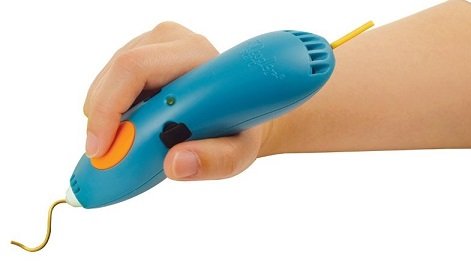
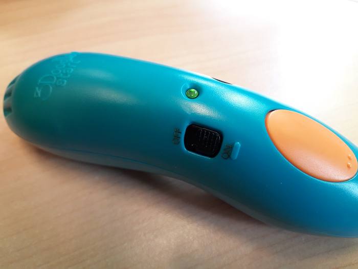
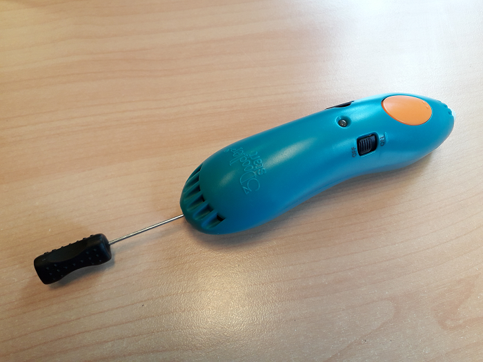

_____Stylo 3D: 3Doodler Start
=============================

Fonction
--------

Le 3Doodler est un stylo faisant fondre du plastique. Il est possible avec de dessiner des formes à plat et en 3 dimensions.

Liens
-----

- `Site officiel <https://learn.the3doodler.com/getting-started/start/>`_ 
- `Idées de projets <https://learn.the3doodler.com/resources/>`_ 

Matériel
--------

Logiciels
---------

Aucun logiciel n'est requis.

Utilisation
-----------

Préparation du matériel
^^^^^^^^^^^^^^^^^^^^^^^

Rechargez le 3Doodler en le branchant par USB à un ordinateur ou à la prise d'un chargeur de smartphone.

.. note:: - La diode clignote en orange pendant la recharge et reste allumée en orange une fois chargée.
 - Il faut compter environ 2h à 2h 30 pour recharger le 3Doodler Start.

.. important:: Il faut anticiper la recharge avant les ateliers.

Pour l'utiliser, débranchez le 3Doodler et mettez l'interrupteur sur On. La diode sera allumée en rouge pendant la chauffe. Une fois à température la lumière sera verte.

Le stylo prêt:

Insérez le filament spécialement conçu pour le 3Doodler (en forme de petites pailles).

.. attention:: - Le stylo ne fonctionne pas avec le filament d'imprimantes 3D, car la température du 3Doodler n'est pas assez élevée pour le faire fondre.
 - Le plastique se consomme très rapidement et est onéreux. Réfléchissez d'abord à votre création avant de la commencer.
 - Il sera important de donner l'appareil qu'après avoir expliqué son fonctionnement, de surveiller son utilisation et de distribuer soit même le filament.

Créez avec le stylo
^^^^^^^^^^^^^^^^^^^

Appuyez une fois sur le bouton orange pour pousser le plastique et une autre fois pour l'arrêter.

Extrusion du plastique: .. image:: extrusion.png

Appuyez deux fois pour retirer le plastique.
Appuyez deux fois pour retirer le plastique.

Conseils
--------

- pour les formes en volume, réaliser plutôt le patron à plat puis plier et renforcer les bords pour créer du volume.
- pour créer votre forme directement en volume tracez votre création lentement, il faut compter environ 35 secondes pour que le plastique devienne solide.

Maintenance
-----------

- si le plastique n'est pas extrudé (ne sors pas par l'embout du stylo), vous pouvez le pousser au début avec une tige métallique.

- si le plastique est difficile à retirer, il vous faudra peut être secouer le stylo pour le faire tomber.