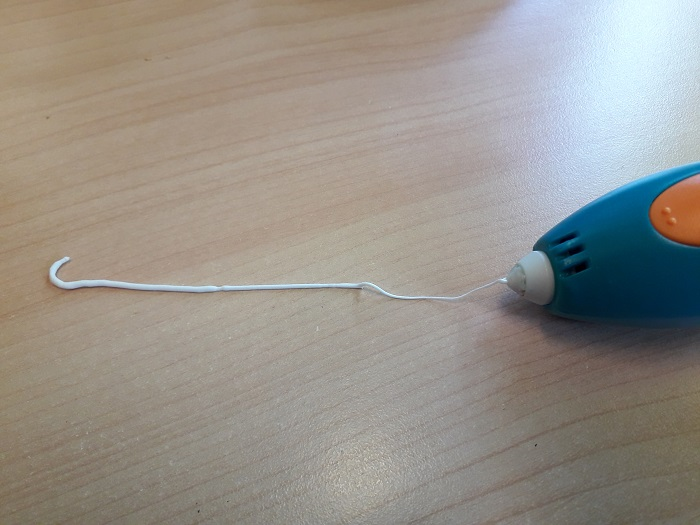

Stylo 3D: 3Doodler Start
========================

- `Site officiel <https://learn.the3doodler.com/getting-started/start/>`_ 
- `Idées de projets <https://learn.the3doodler.com/resources/>`_ 

Matériel
--------

.. image:: 3doodler.jpg

Logiciels
---------

Utilisation
-----------

Rechargez le 3doodler en le branchant par USB à un ordinateur ou la prise d'un chargeur de smartphone.
La diode va clignoter en orange pendant la recharge, une fois chargé à 100% la diode restera allumé en orange.

.. note:: Il faut compter environ 2h à 2h 30 pour recharger le 3doodler Start.

Débranchez le 3doodler et mettez le sur On. La diode sera allumée en rouge pendant la chauffe, une fois à température elle sera allumé en verte.
Le stylo est prêt:

.. image:: pret.png

Mettez un filament spécialement pour le 3doodler.

.. attention:: Le stylot ne fonctionne pas avec le filament d'imprimantes 3D car la température du 3Doodler n'est pas assez élevé pour le faire fondre.

.. attention:: Le plastique se consomme très rapidement et est onéreux. Il sera important de ne donner l'appareil qu'après avoir expliqué son fonctionnement et de surveiller son utilisation.

Sur On: rouge = en train de chauffer
Puis vert: prêt

Appuyer une fois bouton orange: pousser le plastique
Deux fois: retirer le plastique

.. note:: 35 secondes pour que le plastique deviennent solide.

.. important:: TODO: chercher technique pour récupérer le plastique

.. note:: Dessiner les formes à plat pour ensuite les accrocher entre elles en volume en faisant des fixation autour.

.. image:: pousser_filament.png

