Imprimante 3D: 3D UP BOX+
========================

Todo:

- Mettre photo passage filament
- Preview dans printing pour voir les supports et temps. Les suports disparaissent quand on oriente le modèle (bug).
- raft = radier
- chercher où trouver temps d'impression
- chercher si option poser au sol comme dans Cura
- Montrer filament custom et comment sauvegarder

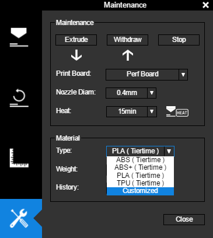

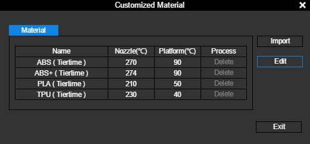

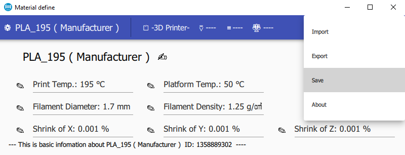

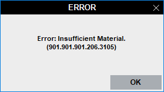

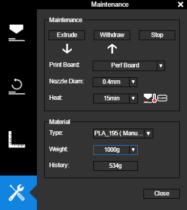

--------------------------------------------

Fonction
--------

L'imprimante 3D vous permet de concevoir des pièces en plastique automatiquement à partir d'un fichier informatique.

Liens
-----

- `Site officiel <https://www.tiertime.com/up-box-plus/>`_
- `Vidéo démarrage rapide <https://youtu.be/QgTA9QPbbdM>`_
- `Documentation officielle <https://3dprintingsystems.com/download/UP_BOX+_Manual_4.8_EN.pdf>`_
- `Forum officiel <https://forum.tiertime.com/c/up-box-up-box/15>`_
- `FAQ <https://www.a4.fr/wiki/index.php?title=FAQ_Imprimantes_3D_TIERTIME>`_

Matériel
--------

.. image:: upbox.png

Logiciel
--------

- `Télécharger Up Studio <https://s3-us-west-1.amazonaws.com/up3d/downloads/UP_Studio_x64_2.6.49.627.zip>`_ (logiciel pour préparer le modèle à l'impression)

Récupérer un modèle sur internet
--------------------------------

- `Thingiverse <https://www.thingiverse.com/>`_

.. note:: Les fichiers sont généralement compressés dans un fichier au format .zip, pour utiliser son contenu double-cliquez dessus puis glissez les fichiers à l'intérieur dans un dossier préalablement créé dans l'ordinateur.
   Vous pouvez ne décompresser que les fichiers .stl, ce sont les modèles 3D.

Utilisation
-----------

Préparation du matériel
^^^^^^^^^^^^^^^^^^^^^^^

.. attention:: Todo parler des deux types de plateaux: UP Flex Board et Perf Board.

- Installez le plateau en le plaquant contre celui en aluminium. Alignez les vis, puis poussez-le vers le fond avec vos mains à plat.

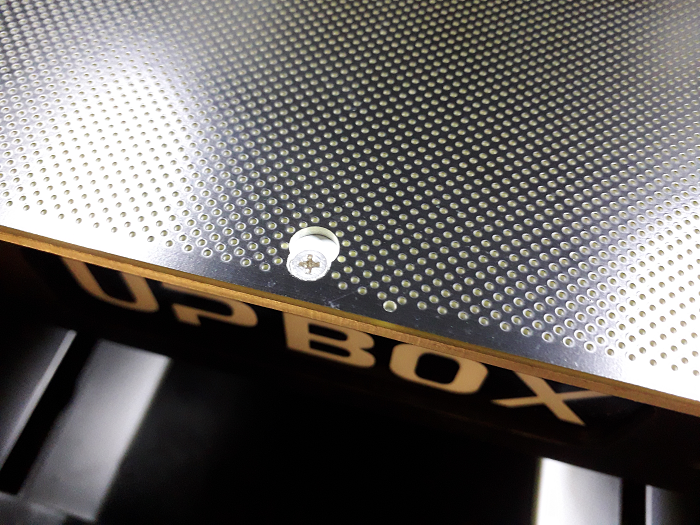

- Enlevez le couvercle magnétique sur le côté et mettez le filament. Si la bobine est épaisse, utilisez la prolongation de fixation avant de mettre la bobine. Ouvrez l'imprimante 3D par le dessus, enlevez le guide-fil de l'extrudeur, faites passer le filament à l'intérieur jusqu'à le voir ressortir puis mettez-le dans l'extrudeur à nouveau. Remettez le couvercle magnétique.

.. note:: Utilisez de préférence du PLA car il est moins polluant que l'ABS.

*Filament en place avec la prolongation de fixation:*

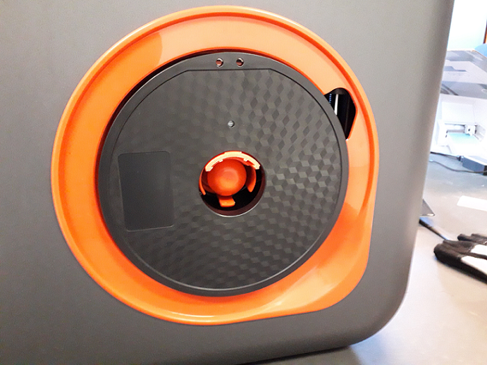

*Le filament ressort par le guide-fil et va dans l'extrudeur:*

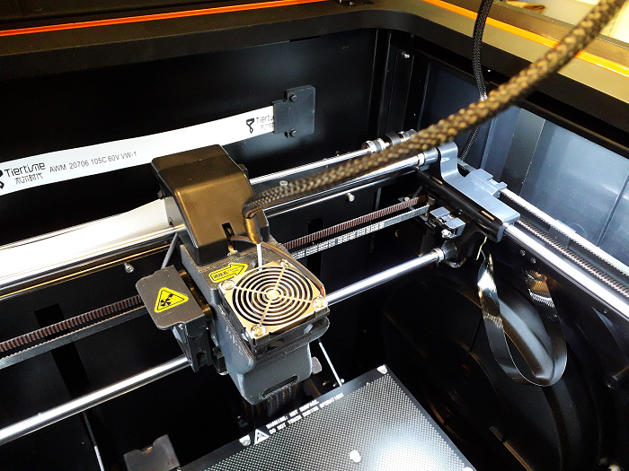

*Couvercle magnétique en place:*

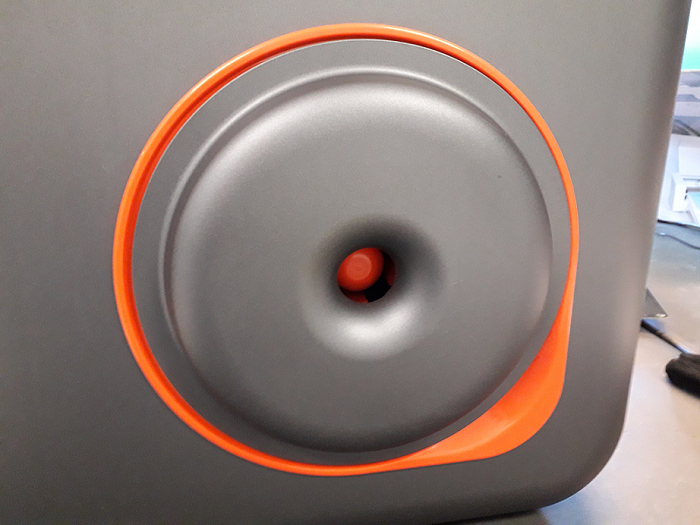

- Connectez l'imprimante en USB, branchez l'alimentation. Appuyez sur le bouton à l'arrière pour la mettre sur On (symbole du trait).

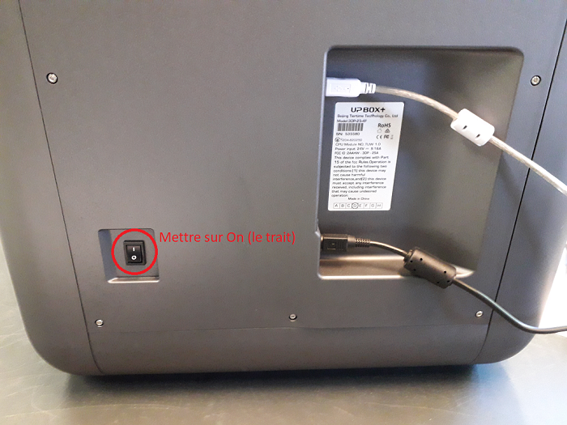

- Restez appuyé sur le bouton d'allumage plusieurs secondes (cela permet d'initialiser l'imprimante à sa position par défaut lors de l'allumage).

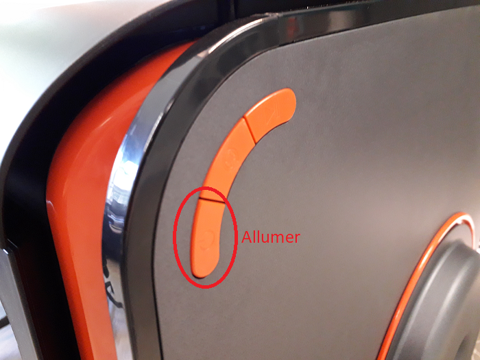

Réglages logiciel
^^^^^^^^^^^^^^^^^

- Lancez le logiciel `Up Studio <file:///C:/Users/MEDIATHEQUE1/Documents/GitHub/test-readthedocs/docs/_build/html/tutorials/fabrication/3dupbox/index.html>`_, c'est un logiciel dans lequel vous importez vos modèles 3D afin de générer un fichier avec les instructions sur la fabrication de celui-ci par l'imprimante 3D.
  Ce type de logiciel s'appelle un "Slicer" (découpeur) car il indique les couches et les trajectoires que devra effectuer l'imprimante pour déposer le plastique.

.. note:: - Au premier lancement du logiciel, il vous sera demandé de vous connecter à un compte, nous vous invitons à créer le vôtre. Cliquez à gauche sur ``Account`` (compte), puis au centre sur ``Sign Up`` (s'inscrire).
   - Lors de votre connexion, cochez ``Auto Login`` pour vous reconnecter automatiquement au lancement du logiciel.

- Calibrez le plateau (à faire impérativement après un transport de l'imprimante), pour cela cliquez sur l'icône ``Calibration`` représentée par deux règles perpendiculaire, dans la fenêtre qui s'ouvre cliquez sur "Auto Level".

.. attention:: TODO: pendant le calibrage, l'imprimante va mesurer la taille de la buse (extrudeur), si l'imprimante fait un bruit de percussion [..]

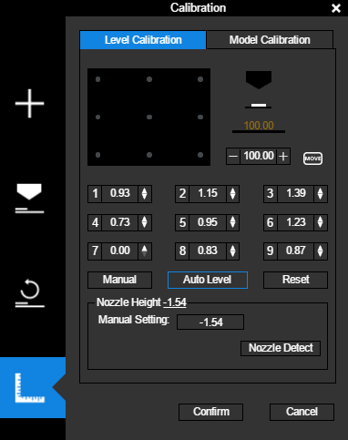

.. important:

- Allez dans Maintenance et vérifiez que le Material type soit bien sûr PLA et que le Print Board soit celui qui est dans l'imprimante (Perf Board ou Up Flex Board).

.. image:: pla.png

.. note:: Pour déboucher la buse, cliquez sur l'icône Maintenance puis sur Extrude, le filament va sortir de la buse, cliquez sur Stop et coupez le à la base avec des ciseaux. Pour remplacer le filament, cliquez sur Withdraw.

Préparer une impression sur UP Studio
^^^^^^^^^^^^^^^^^^^^^^^^^^^^^^^^^^^^^

- Chargez le modèle avec le bouton +. Vous pouvez ajouter un polygone de base qui vous est proposé ou importer un modèle 3D au format .stl ou .obj en cliquant sur Add 3D Model.

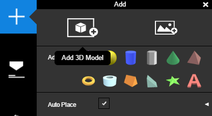

.. note:: Vous pouvez glisser/déposer le fichier dans la vue 3D aussi.

Pour vous déplacer dans la vue 3D:

- le **clic gauche** permet de tourner dans la vue 3D
- la **molette** sert à avancer ou reculer
- le **clic droit** déplace la vue sur les côtés

La "roue" en haut à droite sert à déplacer (le moins utilisé), mise à l'échelle (le plus utilisé), 

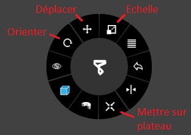

Le Bouton ``Auto Place`` représenté par l'icône d'une croix placec le modèle à la hauteur du plateau.

.. note:: Le modèle touche par défaut le plateau à son importation, mais il peut arriver qu'il ne soit plus en contact après une rotation.

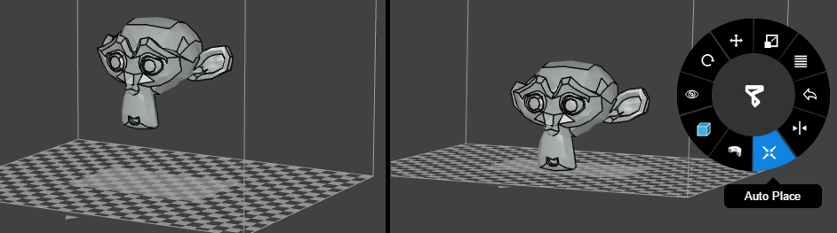

Pour doubler l'échelle, cliquez sur l'icône Echelle puis sur le numéro 2, pour diviser par 2 cliquez sur 0.5. Sur l'image en dessous l'échelle est doublée:

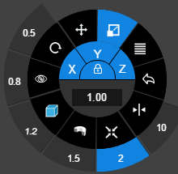

.. attention:: Lorsque vous faites une mise à l'échelle les dimensions sont changées sur 3 axes, en doublant l'échelle vous multipliez le temps d'impression par 2 sur l'axe X, par 2 sur l'axe Y et par 2 sur l'axe Z, vous augmenterez le temps de 2x2x2 donc l'impression prendra 8 fois plus de temps. Une impression qui prenait 1 heure en prendra 8.
Et inversement, en cliquant sur 0.5 vous divisez par 8 le temps d'impression. L'échelle est donc le paramètre qui aura le plus d'incidence sur la durée de l'impression.

L'orientation va permettre d'éviter l'utilisation de supports, donc d'imprimer plus rapidement et de passer moins de temps à poncer le modèle pour lisser les surfaces.

Sur le modèle de gauche l'orientation nécessite beaucoup de supports, la tête est placée à la verticale et l'arrière du crâne et les deux oreilles ont besoin de maintien.
Celui de droite est orienté pour que l'arrière du crâne touche le plateau ainsi qu'une des deux oreilles.

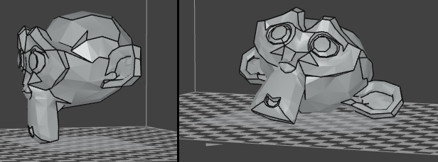

Un autre exemple, sur l'image de gauche le modèle n'a besoin d'aucun support et les surfaces seront plus lisses. Sur l'image de droite, beaucoup de supports seront nécessaire et la surface sera en "escaliers". 

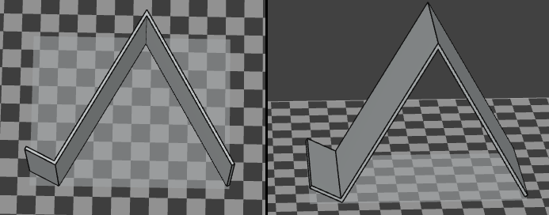

Lancer une impression
^^^^^^^^^^^^^^^^^^^^^

Cliquez sur l'icône Print, des options s'afficheront avant l'impression:

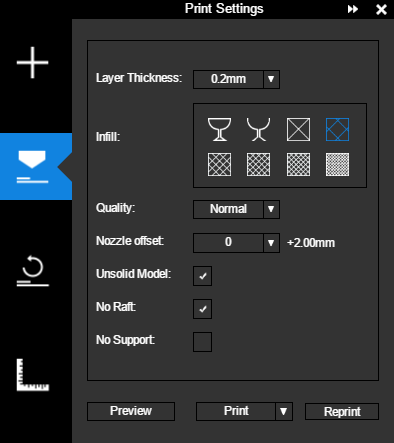

- Layer Thickness: c'est l'épaisseur des couches d'impression, 100 microns servent aux impressions détaillées comme les figurines et 200 pour les pièces mécaniques. Plus l'impression est épaisse moins elle prendra de temps à imprimer.
- Infill: c'est le remplissage, les pièces remplies sont celles qui sont soumises à des forces comme des engrenages.
- Quality: c'est la vitesse de déplacement de la buse, cela affecte la précision du modèle.
- Nozzle offset:
- Unsolid Model: ferme un modèle s'il comporte des trous.
- No Raft: si l'option est cochée cela désactive le support sous l'impression 3D pour renforcer l'adhérence. Une pièce fine et cylindrique par exemple aura besoin d'un raft. Raft se traduire par radeau.
- No Support: désactive les supports. Concevoir et/ou orienter un modèle qui ne nécessite pas de support permet de gagner du temps pendant l'impression et après (découpe des supports, ponçage).

.. attention:: TODO: chercher Nozzle offset et Unsolid Model.

.. attention:: une fois que cela fonctionnera, parler du mode preview, chercher si indicateur de durée.

Cliquez sur Print (imprimer) pour démarrer l'impression.