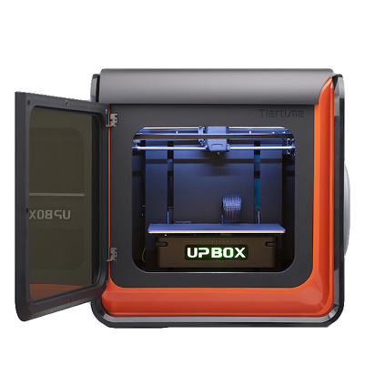

Imprimante 3D: 3D UP BOX+
========================
Todo:

- Matériel Carte SD et son utilisation

Matériel
--------

- `Site officiel <https://www.tiertime.com/up-box-plus/>`_
- `FAQ <https://www.a4.fr/wiki/index.php?title=FAQ_Imprimantes_3D_TIERTIME>`_

Logiciel
--------

- `Télécharger Up Studio <https://s3-us-west-1.amazonaws.com/up3d/downloads/UP_Studio_x64_2.6.49.627.zip>`_ (logiciel pour préparer le modèle à l'impression)

Utilisation
-----------

Préparation matériel
^^^^^^^^^^^^^^^^^^^^

- Installez le plateau en le plaquant contre celui en aluminium. Alignez les vis, puis poussez vers le fond en utilisation toute la surface de vos mains.
- Enlevez le couvercle magnétique, ajoutez le filament sur le côté du dévidoir. Si la bobine est épaisse, utilisez la prolongation de fixation avant de placer la bobine. Décrochez le guide-fil de l'extrudeur, faites passer le filament dans le guide jusqu'à le voir de l'autre côté puis placez le fil dans l'extrudeur. 
  Remettez le couvercle magnétique.
- Branchez l'imprimante. Mettez le bouton à l'arrière de l'imprimante sur On. Restez appuyé sur Power pour initialiser l'imprimante.

Préparer une impression
^^^^^^^^^^^^^^^^^^^^^^^

Lancez le logiciel **Up Studio** (lien de téléchargement plus haut), c'est un logiciel dans lequel vous importez vos modèles 3D afin de générer un fichier avec les instructions sur la fabrication de celui-ci par l'imprimante 3D.

.. note:: - Au premier lancement du logiciel, il vous sera demandé de vous connecter à un compte, nous vous invitons à créer le vôtre. Cliquez à gauche sur Account (compte), puis au centre sur Sign Up (s'inscrire).
   - Lors de votre connexion cochez "Auto Login" pour vous reconnecter automatiquement au lancement du logiciel.

Récupérer un modèle sur internet
^^^^^^^^^^^^^^^^^^^^^^^^^^^^^^^^

- `Thingiverse <https://www.thingiverse.com/>`_

.. note:: Les fichiers sont généralement compressés dans un fichier au format .zip, pour utiliser son contenu double-cliquez dessus puis glissez les fichiers à l'intérieur dans un dossier préalablement créé dans l'ordinateur.
   Vous pouvez ne décompresser que les fichiers .stl, ce sont les modèles 3D.

**WIP**

Positionner l'impression
^^^^^^^^^^^^^^^^^^^^^^^^

Ajuster modèle avec la roue

Lancer une impression
^^^^^^^^^^^^^^^^^^^^^^

Calibration auto

Maintenance extrudeur

Charger modèle en cliquant sur le +