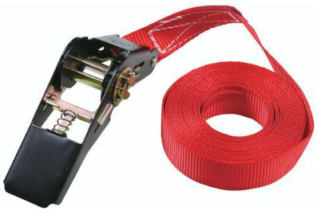

Achats
======

.. note:: Dimmensions  en cm (longueur, largeur, hauteur).

- 3D Up Box+: 490 x 490 x 510
- Silhouette Curio: 290 x 490 x 250
- Roland GS-24: 500 x 870 x 1070
- Bernina: 460 x 760 x 400
- Dagoma: 330 x 330 x 550

Chariot 1 plateau bois rebords 965x655mm 250 Kg Variofit (entre deux plateaux 535 mm): https://www.manutan-collectivites.fr/chariot-1-plateau-bois-rebords-965x655mm-250-kg-variofit-itg3048277.html?refCom=Tous&webdo_20000509=Tous&webdo_20000225=Tous&webdo_20003721=Tous

.. image:: chariot.png

4x Sangle d'arrimage à tendeur cliquet - Force 350 kg - Manutan (5 mètres): https://www.manutan-collectivites.fr/sangle-d-arrimage-a-tendeur-cliquet-force-350-kg-manutan-itg2259295.html

2x (3D Up Box+ + un en plus): Bac 175L, parois et fond pleins , recyclé, Noir LxlxH = 800x600x425mm: https://www.manutan-collectivites.fr/bac-175l-parois-et-fond-pleins-recycle-noir-lxlxh-800x600x425mm-110267003.html?refCom=Tous&webdo_20001652=Tous&webdo_20000041=Tous&webdo_20003804=Tous

.. image:: bac_grand.png

7x (Curio + Bernina + Dagoma 1 + Dagoma 2 + onduleurs + 10 PCs + 10 tablettes graphique): Bac 22L, parois et fond pleins , recyclé, Noir LxlxH = 600x400x120mm: https://www.manutan-collectivites.fr/bac-22l-parois-et-fond-pleins-recycle-noir-lxlxh-600x400x120mm-110266003.html?refCom=Tous&webdo_20001652=Tous&webdo_20000041=Tous&webdo_20003804=Tous

.. note:: Toutes les machines ne seront pas déplacées en même temps.

.. image:: bac_moyen.png