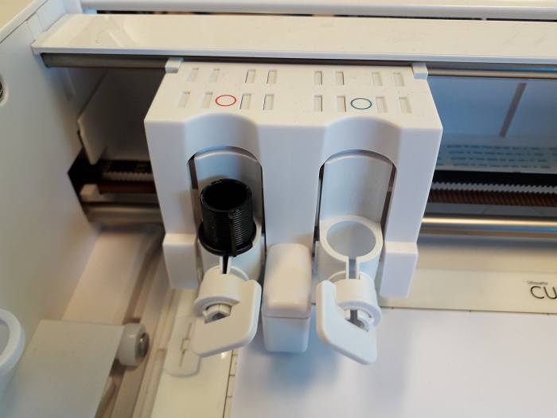

Découpeuse vinyl: Silhouette Curio
===================================

todo lexique tapis
Vracs:

Setting up your Silhouette Curio: https://youtu.be/FrmaGT_qzXo

How to cut images on Silhouette Curio 3t for beginners, simple, easy, quick: 
https://www.youtube.com/watch?v=HnJT4H78BOs

`Docs <http://www.silhouettefr.fr/silhouette_tutoriels.html>`_

`How to <https://www.silhouetteamerica.com/how-to>`_

https://youtu.be/emxLgXyxpMg

Matériel
--------
- `Site officiel <http://silhouettefr.fr/silhouette_curio.html>`_

Logiciels
---------

- `Télécharger Silhouette Studio <https://dl.silhcdn.com/58b7a26b84874c6e>`_

Utilisation
-----------

- Libérez de l'espace pour déplier les pieds de stabilisation à l'avant et arrière de la Curio.
- Prenez une base d'adhérence aux dimensions de la matière à couper.
- Enlevez la protection et collez la matière.

.. important:: La matière doit être aligné en haut à droite du tapis.

- Accrochez-le avec les quatre maintiens sur le côté.

.. attention:: TODO parler des plateformes et comment les choisir. Il y en a une de 1 et deux de 2.

.. image:: maintien.png

- Glissez le support dans la curio, l'encoche (cercle rouge) doit dépasser le bord de la Curio (trait orange):

.. image:: encoche.png

- Prenez la lame découpe et réglez sa profondeur avec l'avant de la Curio. La flèche rouge indique la profondeur choisi, cette flèche dit être aligné avec l'avant de la Curio pour procéder au réglage.

.. note:: Profondeurs de lame:

   - 1: vinyl
   - 2 - 3: papier
   - 4 - 6: papier cartonné
   - 7 - 10: toile

- Placez la lame à l'emplacement du cercle rouge, tournez l'interrupteur dans le sens inverse des aiguilles d'une montre pour l'ouvrir et dans l'autre pour le vérouiller.

- Branchez et allumez la Curio, la machine va initialiser sa position par défaut.

.. image:: boutons.png