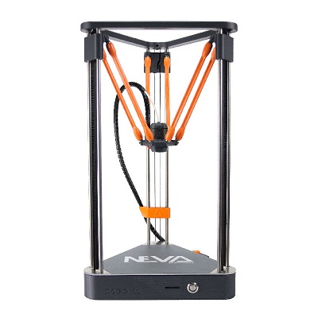

Imprimante 3D: Dagoma Neva Magis
=================================

Fonction
--------

Liens
-----

- `Site officiel <https://www.dagoma3d.com/imprimante-3d-magis-dagoma>`_
- `Forum <https://www.lesimprimantes3d.fr/forum/41-dagoma/>`_
- :download:`Débouche buse <dagoma0.zip>` (aide à la détection)

Matériel
--------

Logiciel
--------

- `Télécharger Cura by Dagoma <https://dist.dagoma3d.com/get/zip/CuraByDagoma/1568220765/6d41d9077db0874f55a6d89c0914a9f4>`_ (logiciel pour préparer le modèle à l'impression)
