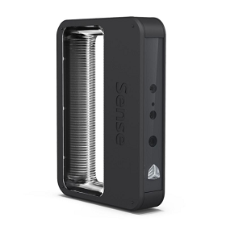
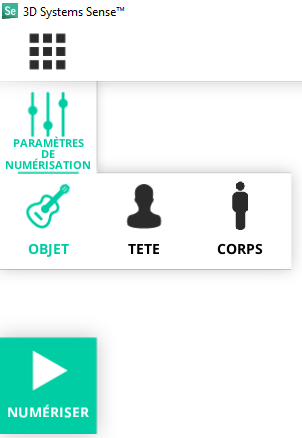
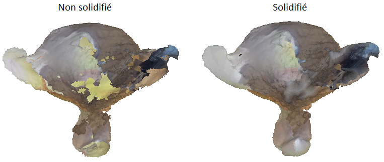

Photogramétrie: Sense 3D V2
===========================

https://youtu.be/ye-C-OOFsX8

- `Site officiel <https://fr.3dsystems.com/3d-scanners/sense-scanner>`_
- `Guide utilisateur <https://s3.amazonaws.com/dl.3dsystems.com/binaries/support/sense-scanner/Sense2_UserGuide_031519.pdf>`_
- :download:`Sense Track Assist <Sense_TrackAssist.pdf>`

Matériel
--------

Logiciels
---------

- `Télécharger le logiciel 3D Systems Sense <https://telecharger.freedownloadmanager.org/Windows-PC/3D-Systems-Sense/GRATUIT-2.2.0.240.html?ac1acbc>`_

Utilisation
-----------

Vidéo explicative: https://youtu.be/1eWUaxq-oGg

Solidify rempli les trous automatiquement.

.. note:: Le scanner doit être connecté de préférence à un port USB 3.0 pour améliorer les performances. Ces ports USB sont souvent en bleu.

.. attention:: Le logiciel 3D Systems Sense ne permet pas de retour arrière. Exporter votre modèle régulièrement avant une manipulation. Vous pourrez effectuer les mêmes tâches (en plus complexe) sur le logiciel de 3D Blender.

.. note:: Conseils pour scanner:

   - Tenez-vous à environ 45 cm à 2 mètres de l'objet. La distance dépend aussi de la taille de ce qui est scanné.
   
      - Si l'objet scanné devient blanc c'est que vous êtes trop proche.
   - Vous pouvez faire plusieurs tours avec différents angles pour ajouter des données au scan et remplir les trous.
   - Scannez avec un angle à 45 degrés vers le bas pour le premier tour.
   - Pour une personne pointez la caméra vers le visage.

.. note:: Chaque 30 degré autour du modèle le logiciel va demander de rester fixe quelques seconde pour optimiser la capture.

.. note:: Eclairage en intérieur et dans plusieurs directions. Il faut le moins d'ombre possible.

.. note:: Le retour arrière n'est possible qu'avec les flèches, vous ne pouvez le faire avec Ctrl + Z.

.. image:: retour.png

.. note:: L'outil couper supprimer la zone la plus petite.

Il faut cliquer sur Terminer pour exporter

Cliquer sur Numériser à gauche pour démarrer, positionnez bien la caméra pendant le compte à rebourd pour ne pas capturer un autre objet.

.. attention:: Avec le niveau de détail maximal le scan peut rapidement perdre l'object.

Réparation > Solidifier

Test:

.. image:: test.png

Corriger son scan 3D sous Blender
---------------------------------

Importer le .obj

Faire un scale à 0.05. Ajoutez un cube et faites un scale et positionnez l'objet pour qu'il rentre à peu près dans le cube. Orientez le modèle pour qu'il soit à l'endroit. Puis faire un Apply en All Transforms.

Remesh à 0.05

Sculpt mode sans symmétrie

Smooth puis Inflate puis nouveau remesh

Continuer avec le inflate, smooth, snake hook et remesh pour reconstituer le modèle original