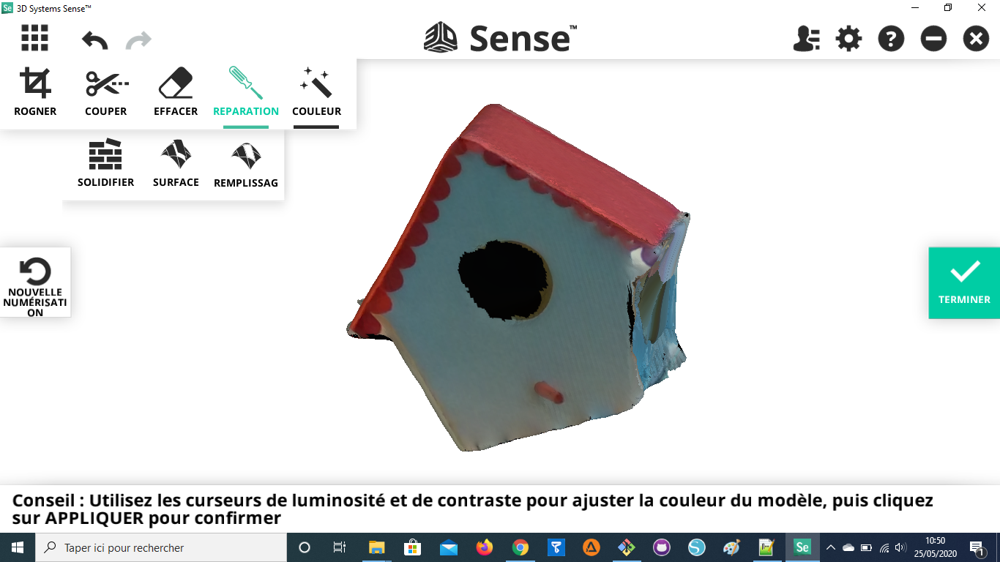

Scanner: Sense 3D V2
====================

- `Site officiel <https://fr.3dsystems.com/3d-scanners/sense-scanner>`_
- `Guide utilisateur <https://s3.amazonaws.com/dl.3dsystems.com/binaries/support/sense-scanner/Sense2_UserGuide_031519.pdf>`_

Matériel
--------

Logiciels
---------

- `Télécharger le logiciel 3D Systems Sense <https://telecharger.freedownloadmanager.org/Windows-PC/3D-Systems-Sense/GRATUIT-2.2.0.240.html?ac1acbc>`_

Utilisation
-----------

.. note:: Le scanner doit être connecté de préférence à un port USB 3.0 pour améliorer les performances. Ces ports USB sont souvent en bleu.

.. attention:: Le logiciel 3D Systems Sense ne permet pas de retour arrière. Exporter votre modèle régulièrement avant une manipulation. Vous pourrez effectuer les mêmes tâches (en plus complexe) sur le logiciel de 3D Blender.

.. note:: Conseils pour scanner:

   - Tenez-vous à environ 45 cm à 2 mètres de l'objet. La distance dépend aussi de la taille de ce qui est scanné.

Test:

Corriger son scan 3D sous Blender
---------------------------------