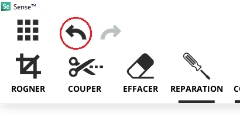

Photogrammétrie: Sense 3D V2
============================

Fonction
--------

Un scanner 3D capture la forme d'objets réel pour en faire des modèles 3D virtuels sur l'ordinateur.
A partir de ces fichiers il est ensuite possibe de concevoir de nouveles pièces afin de réparer et améliorer un objet.
Les objets scannés sont souvent utilisé dans les jeux vidéo moderne.

Liens
-----

- `Site officiel <https://fr.3dsystems.com/3d-scanners/sense-scanner>`_
- `Guide utilisateur <https://s3.amazonaws.com/dl.3dsystems.com/binaries/support/sense-scanner/Sense2_UserGuide_031519.pdf>`_
- :download:`Sense Track Assist <Sense_TrackAssist.pdf>` (aide à la détection)

Matériel
--------

.. image:: sense.png

Logiciels
---------

- `Télécharger le logiciel 3D Systems Sense <https://telecharger.freedownloadmanager.org/Windows-PC/3D-Systems-Sense/GRATUIT-2.2.0.240.html?ac1acbc>`_

Utilisation
-----------

Après avoir installé le logiciel 3D Systems Sense connectez le scanner sur un port USB.

.. note:: Connectez le scanner sur un port USB 3.0 pour améliorer les performances, ces ports sont souvent en bleu.

Vous devriez voir l'affichage de la caméra dans le logiciel. Choisissez le type d'objet à scanner entre Objet, Tête et Corps puis cliquez sur "Numériser" pour commencer.

.. image:: scan_type.png

.. note:: Conseils pour scanner

   - Tenez-vous à une distance d'environ 45 cm à 2 mètres de l'objet, selon la taille de l'objet qui est scanné.
   
      - Si l'objet scanné devient blanc, c'est qu'il est mal détecté, cela peut-être parce qu'il est trop proche, parce qu'il est brillant, parce qu'il n'y a pas assez de points de repère (une sphère par exemple. Dans le dernier cas, vous pouvez ajouter une feuille de repère sous l'objet pour améliorer la détection: :download:`Sense Track Assist <Sense_TrackAssist.pdf>`

-------------------------------------------------------------------------------------

Vidéo explicative: https://youtu.be/1eWUaxq-oGg

Solidify rempli les trous automatiquement.

.. attention:: Le logiciel 3D Systems Sense ne permet pas de retour arrière. Exporter votre modèle régulièrement avant une manipulation. Vous pourrez effectuer les mêmes tâches (en plus complexe) sur le logiciel de 3D Blender.

.. note:: Conseils pour scanner:

   - Tenez-vous à environ 45 cm à 2 mètres de l'objet. La distance dépend aussi de la taille de ce qui est scanné.
   
      - Si l'objet scanné devient blanc, c'est que vous êtes trop proche.
   - Vous pouvez faire plusieurs tours avec différents angles pour ajouter des données au scan et remplir les trous.
   - Scannez avec un angle à 45 degrés vers le bas pour le premier tour.
   - Pour une personne, pointez la caméra vers le visage.

.. note:: Chaque 30 degrés autour du modèle le logiciel va demander de rester fixe quelques secondes pour optimiser la capture.

.. note:: Éclairage en intérieur et dans plusieurs directions. Il faut le moins d'ombre possible.

.. note:: Le retour arrière n'est possible qu'avec les flèches, vous ne pouvez le faire avec Ctrl + Z.

.. note:: L'outil couper supprimer la zone la plus petite.

Il faut cliquer sur Terminer pour exporter

Cliquer sur Numériser à gauche pour démarrer, positionnez bien la caméra pendant le compte à rebours pour ne pas capturer un autre objet.

.. attention:: Avec le niveau de détail maximal le scan peut rapidement perdre l'object.

Réparation > Solidifier

.. image:: Solidification.png

Test:

.. image:: test.png

Corriger son scan 3D sous Blender
---------------------------------

Importer le .obj

Faire un scale à 0.05. Ajoutez un cube et faites un scale et positionnez l'objet pour qu'il rentre à peu près dans le cube. Orientez le modèle pour qu'il soit à l'endroit. Puis faire un Apply en All Transforms.

Remesh à 0.05

Sculpt mode sans symmétrie

Smooth puis Inflate puis nouveau remesh

Continuer avec le inflate, smooth, snake hook et remesh pour reconstituer le modèle original
