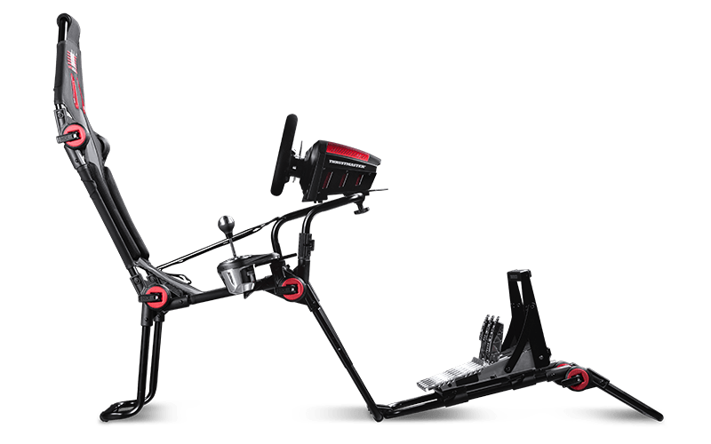

Veille technologique été 2020 - Danyl
=====================================

Logiciels/développement
------------------------

- ZBrushCoreMini logiciel gratuit avec tous les outils essentiels pour la sculpture, il sera utilisé en sculpture organique.

.. note:: Gratuit https://youtu.be/gxyMejEA0PE

- Godot 4.0 apporte des avancés notables sur le rendu graphique. Il utilise un langage proche de Python. Le moteur pourrait être utilisé pour créer des jeux 3D: https://youtu.be/MbCVixMSDvo

.. note:: Gratuit: https://godotengine.org/

- Core, basé sur Unreal Engine 4, permet de créer des jeux rapidement, souvent orienté de tir. Les graphismes ressemblent à Fortnite. Nécessite une connexion internet pour être utilisé et de le mettre souvent à jour. Le logiciel propose beaucoup de ressources et de scripts (codes) déjà réalisés. https://youtu.be/2aTfknWRXAc

Tutoriel sur la création d'un jeu multijoueur avec Core: https://youtu.be/-rIbd612sUM

.. note:: Gratuit: https://www.coregames.com/

Impression 3D
-------------

- Elegoo Saturn, première grande imprimante résine abordable avec une vitesse de 1.5-2s par layer à 50 microns (plusieurs minutes pour la 3D Up Box+ à 200 microns): https://youtu.be/VNxcpQEBlWY

.. note:: Prix 400 dollars (sortie en octobre): https://www.elegoosaturn.com/products/elegoo-saturn-8-9-inch-4k-uv-lcd-3d-printer

VR
--

- Pimax 8k+ une résolution 8 fois supérieures à l'Occulus Rift qui souffre d'une image très pixelisée et floue: 2*3840×2160 pour le Pimax 8k+ contre 2*1080×1200 pour l'Occulus Rift et un angle de vue bien supérieur à 200 degrés: https://youtu.be/gozLg1DHUiQ

.. note:: Prix 899 dollars: https://www.pimax.com/products/vision-8k-plus-withoutmas

.. image:: Pimax.png

Jeux vidéo
----------

- Microsoft Flight Simulator: première simulation à intégrer un scan laser de la planète entière à quelques mètres près (inclus la MDE et votre maison): https://youtu.be/TYqJALPVn0Y

- Car Mechanic Simulator propose aussi Motorcycle Mechanic Simulator pour la réparation de moto  et Biker Garage Mechanic Simulator pour la réparation de motos américaines.

Simulation
----------

- F-GT Lite: premier cockpit pliable avec fauteuil, support levier de vitesse et position configurable: https://youtu.be/vMiLRCpc3uQ

.. note:: Prix 299 euros: https://www.nextlevelracing.com/products/f-gt-lite/

- Alternative à la VR pour le simulateur et d'autres jeux en immersion, Samsung C49HG90DMU FreeSync (dalle incurvée): https://youtu.be/BPaL_Mp9HK4

.. note:: Prix 899 euros: https://www.topachat.com/pages/detail2_cat_est_peripheriques_puis_rubrique_est_w_moni_puis_ref_est_in10111427.html

.. image:: wide.jpg

Si évolution du projet du simulateur
^^^^^^^^^^^^^^^^^^^^^^^^^^^^^^^^^^^^

- AccuForce Pro V2: Le meilleur rapport qualité prix pour un volant à technologie Direct Drive, seul problème il est bruyant (attendre pour une version au-dessus): https://youtu.be/g-XCq4fMekc

.. note:: Prix 999 dollars https://simxperience.com/products/accessories/accuforcesteering/accuforcepro.aspx

.. image:: accuforce.jpg

- Sim Lab GT-1 EVO: Le meilleur cockpit fixe et abordable actuel (pour un simulateur qui resterait souvent sur place, vissé dans un véhicule ou prêté longtemps): https://youtu.be/jpJdxDsYIrs

.. note:: Prix 399 euros https://sim-lab.eu/shop/product/gt-1-evo-sim-racing-cockpit-446?category=3#attr=354

.. image:: gt1.jpg

- Les meilleures pédales haut de gamme abordables actuelles: https://youtu.be/SMwcFrTsKd4

.. note:: Prix 699 euros https://heusinkveld.com/products/sim-pedals/sim-pedals-sprint/?q=%2Fproducts%2Fsim-pedals%2Fsim-pedals-sprint%2F&v=11aedd0e4327

**Aperçu du simulateur complet avec l'écran ultra wide (camion aménagé):** https://youtu.be/7R4LmSNsMws